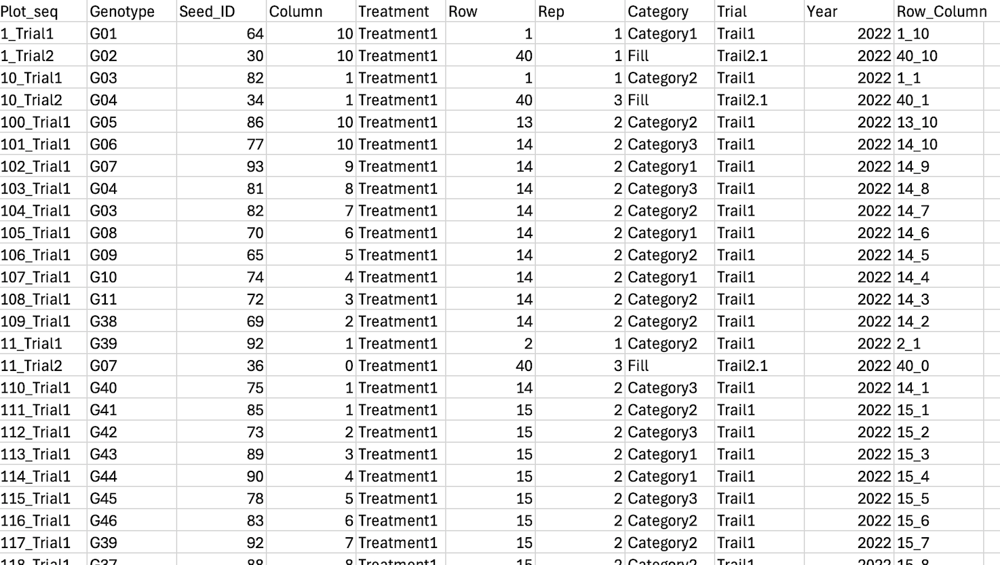
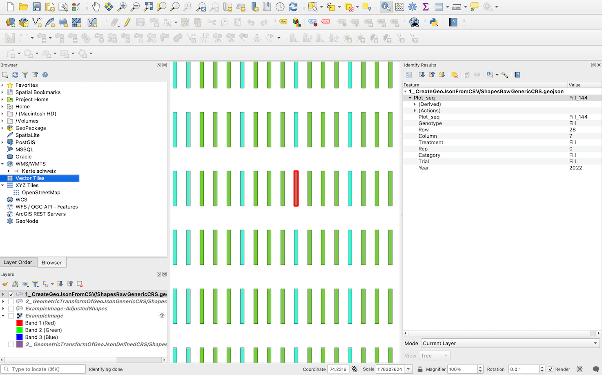
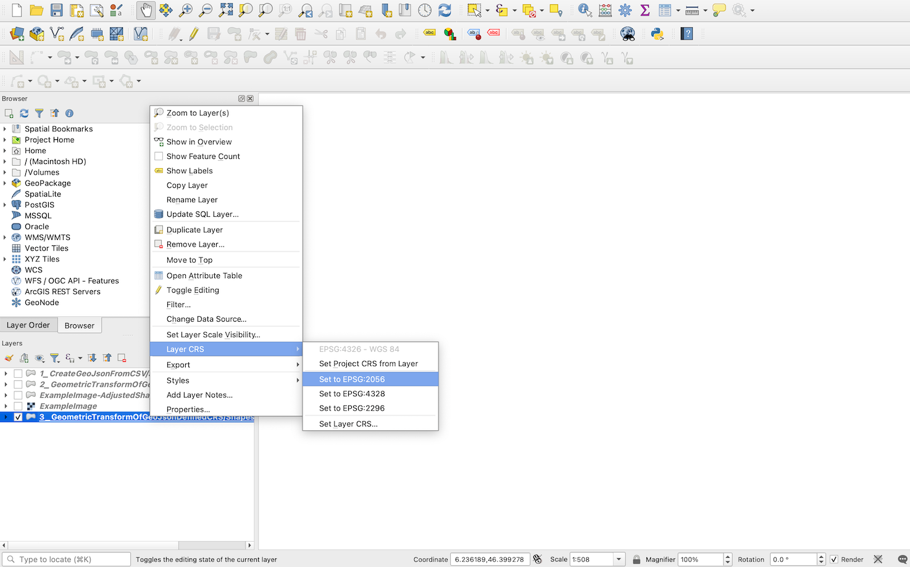
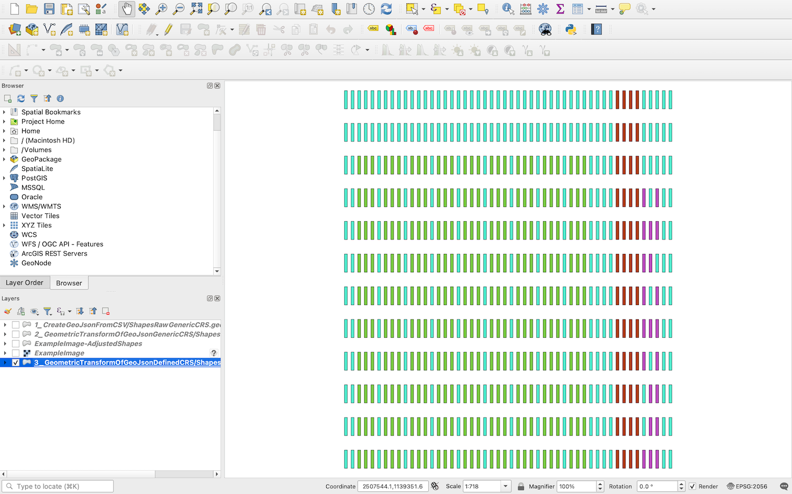

# Shape creation and geometric transformation using homography

This repository is a tutorial to create 4-sided polygons as shapes in order to mask regions of interest (ROI) in agricultural trials. It contains three principle sections:

1. A GeoJson file with plot shapes in a generic coordinates  is created in Python based on a CSV file that contains metadata
1. The GeoJson is transformed based on the homography calculated from four corresponding points
1. The same as 1. but in a defined orthogonal geographic coordinate reference system (CRS)

At each step a description of the process is provided together with example code and all example data required. It's suggested to work through this example and make it run on your computer before you try it on your own data. An overview on the single steps is given below.

This repository is related to the publication "PhenoCams", published in [The Plant Phenome Journal](https://acsess.onlinelibrary.wiley.com/journal/25782703?utm_source=google&utm_medium=paidsearch&utm_campaign=R3MR425&utm_content=LifeSciences&gad_source=1&gclid=Cj0KCQiAoae5BhCNARIsADVLzZcx_z2oN_tmu4lxL6P_ClUyUV0RayKF0oClDRJePuZDpdBW5dsR6c8aAkmBEALw_wcB) ([Add DOI here](Add DOI here)).

The research was conducted at and financed by [Agroscope](https://www.agroscope.admin.ch) in the group of [Cultivation Techniques and Varieties in Arable Farming](https://www.agroscope.admin.ch/agroscope/en/home/about-us/organization/competence-divisions-strategic-research-divisions/plant-production/cultivation-techniques-varieties-arable-farming.html).

## Generating shape files in order to mask regions of interest (ROI) in images of agricultural experiments

Generating shape files to mask ROIs on single images or georeferenced aerial image data can be tedious and time consuming. These shapes must be complemented with metadata such as shape ID, but also information like genotype, treatment etc. . Doing it all manually is prone to errors. Therefore, doing it based on a CSV file that contains already metadata on the shapes and positional information (*e.g.* row and column position of the shape in an experiment) is handy and also helps to reduce errors.

Shapes can be produced in a generic CRS, *e.g.* image coordinates for single images (section 1_CreateGeoJsonFromCSV). If images are not taken in nadir orientation (*i.e.* pointing straight down to the experiment), shapes may require a perspective transformation (section 2_GeometricTransformOfGeoJsonGenericCRS). If working with georeferenced orthomosaics, also orthogonal geographic coordinate systems might be used (section 3_3_GeometricTransformOfGeoJsonDefinedCRS).

#### 1_CreateGeoJsonFromCSV

In this folder, its described, how, based on a CSV file, that contains positional arguments, and meta data, GoeJson files as in the following figure can be created.

*Shapes generated with a Python script based on a CSV file.*

The CSV file contains information on the shapes position inside the experiment (row and column coordinates) which are imortant for the geometry creation of the shapes. With the metadata, the shapes can be enriched to facilitate further analysis. The GeoJson is generated in a generic coordinate system (*e.g.* image coordinates).

|  |  |
|---------------------------------------|---------------------------------------|
| *A CSV file containing positional arguments and metadata is the imput neede to create a GeoJson.*                           | *The GeoJson already contains metadata. The meta data of the plot highlighted in red can be seen in the table on the right.*                           |

#### 2_GeometricTransformOfGeoJsonGenericCRS

If images are taken from an oblique perspective, a geometric transformation of the plots might be necessary. The second folder contains a script that allows to adopt the orthogonal GeoJson of the first step to perspective view by a homography transform. The homography is estimated based on 4 correponding points between the orthogonal shapes and a corresponding image. After the transform, a manual adjustment of the shapes is necessary.

|  |  |
|---------------------------------------|---------------------------------------|
| *The shapes of the previous step after a homography transform. All the shapes of the GeoJson are transformed, but the further away from the corresponding points, the more errenous is the projection.*|*The tranformed projection must be manually cleaned and adjusted, so just the relevant shapes are left and fit well the*                          |

#### 3_GeometricTransformOfGeoJsonDefinedCRS

Such images need to be transformed 

|  |  |
|---------------------------------------|---------------------------------------|
| *Caption 1*                           | *Caption 2*                           |